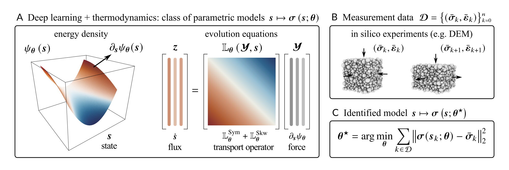

<div align="center">

# Learning inelastic material models under hard thermodynamic constraints


</div>

This repository accompanies the following [paper](https://doi.org/10.1016/j.cma.2026.119260):

> Filippo Masi, "Learning inelastic constitutive models from stress–strain
> data under hard thermodynamic constraints." Computer Methods in Applied Mechanics and Engineering 461 (2026), 119260.

The framework couples two neural parameterizations:

- a (convex or partially input-convex) free energy
  $`\psi_{\boldsymbol{\theta}}(\boldsymbol{s})`$, whose derivatives define
  stress and internal thermodynamic forces (first law of thermodynamics),
- a state-dependent transport operator
  $`\mathbb{L}_{\boldsymbol{\theta}}`$, constructed as
  $`\mathbb{T}_{\boldsymbol{\theta}}
  \mathbb{T}_{\boldsymbol{\theta}}^\mathsf{T}
  +\mathbb{L}^{\mathrm{skw}}_{\boldsymbol{\theta}}`$ (second law of thermodynamics).
   
  
<p align="center">
  
</p>


### Setup

```bash
python -m pip install -r requirements.txt
```

### Experiments

Run all commands from the repository root.

#### Training

```bash
python elasto_plastic_training.py
python drucker_prager_training.py
python isotropic_hardening_training.py
```

Training writes new files named `*_retrained.pt`, without overwriting the corresponding checkpoints.

For a one-update smoke run:

```bash
HARD_THERMO_EPOCHS=2 python *_training.py
```
#### Inference

```bash
python elasto_plastic_inference.py
python drucker_prager_inference.py
python isotropic_hardening_inference.py
```

Each script reconstructs the model and normalization from the training data,
loads a checkpoint with `weights_only=True`, solves for the initial elastic
strain, integrates the unseen protocol, and displays a reference-versus-model
plot.


### Tests

Unit tests to verify the physical and numerical methods encoded by the implementation:

- ICNN and PICNN convexity
- zero energy and thermodynamic forces at the reference state
- positive-semidefinite symmetric transport and non-negative dissipation
- skew-operator power orthogonality
- differentiability of the training integrator
- loading-knot alignment
- strict compatibility with the two canonical checkpoints.

```bash
python -m unittest discover -s tests -v
```

### How to cite

```bibtex
@article{masi2026learning,
  title   = {Learning inelastic constitutive models from stress--strain data
             under hard thermodynamic constraints},
  author  = {Masi, Filippo},
  journal = {Computer Methods in Applied Mechanics and Engineering},
  volume  = {461},
  pages   = {119260},
  year    = {2026},
  doi     = {https://doi.org/10.1016/j.cma.2026.119260}
}
```

